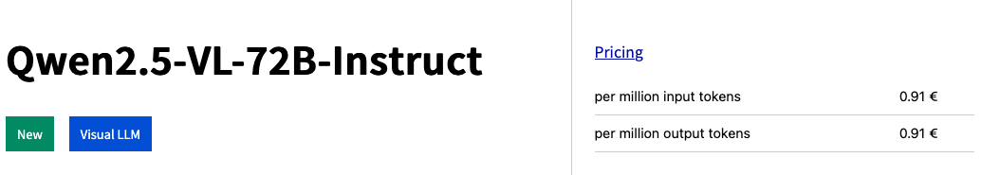
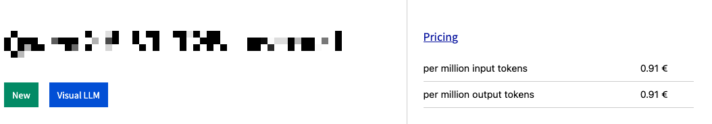

# redact
A simple UI to redact information from images as I dont want to install too many tools locally.
Possible options are to pixelate or use colored bars.

This page was created using ✨Vibe Coding✨ (Gemini 2.5 Pro experimental), which was rather vibeless as this page is just veeery simple and I just needed a simple tool.

Hosted on github pages: [click me](https://melching.github.io/redact/)

### Example

Before:

After:

